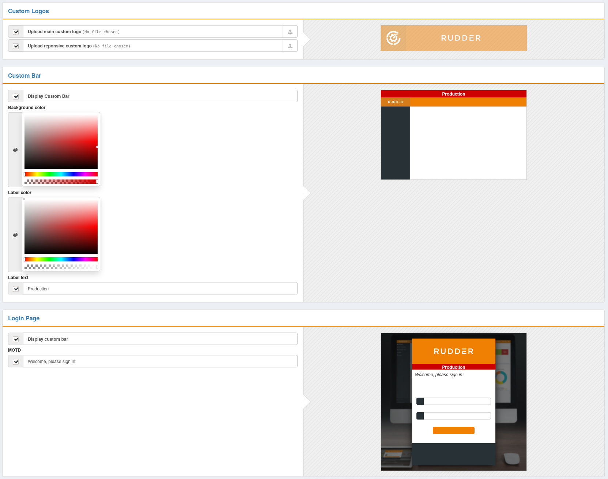

# Rudder plugin: Branding

This project is part of Rudder - IT infrastructure Automation and Compliance.
See: http://rudder.io for more information.

See repository main README for information about licensing, contribution, and
other general information.

// Everything after this line goes into Rudder documentation
// ====doc====
[branding]
= Branding

This plugin allows to customize some part of Rudder UI to facilitate its integration with
your other applications or internal branding but also to clearly differentiate among
several Rudder instances (typically, with a dedicated color and message for test/qa/prod instances).

