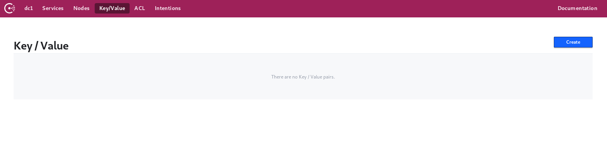
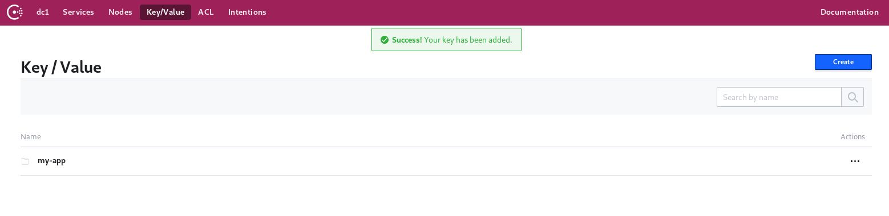
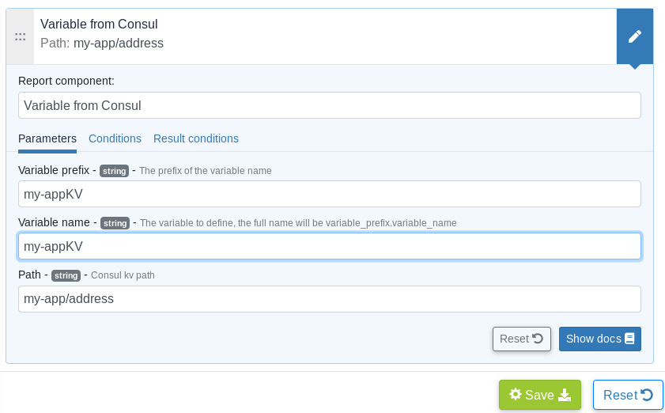

# Plugin for Consul and Rudder

This project is part of Rudder - IT infrastructure Automation and Compliance. See: http://rudder.io for more information.
See repository main README for information about licensing, contribution, and other general information.

// Everything after this line goes into Rudder documentation
// ====doc====
[consul-plugin]
= Consul

Consul is a service mesh solution that provides a dedicated infrastructure layer to basically solve the challenges of microservices architecture, some of its main key
features are:

* Enables dynamic discovery of new instances.

* Share, synchronize and store key-value between instances.

* Provide an ACL system and enable traffic encryption.

* Provide a healthcheck service that return the health state of differents services.

* Provides a cluster of server nodes to ensure high availability.

This plugins offers the possibility to fetch key-value either from Consul server nodes or Consul agent nodes and then use them as Rudder Variables according to 
your needs. The Rudder server does not need to access the Consul server to get key-value, only the Rudder agent will do so.

== Installation

* You're supposed to already have your Consul environment configured, with differents keys-values that can be: Indexed objects, configuration parameters or metadata.

* You must download and install the plugin from the repository with the rudder-pkg tool on your Rudder server.

....
rudder package install-file <path to the rpkg>
....

Or if you have an active subscription: 

....
rudder package install rudder-plugin-consul
....

* Once the plugin is installed, you need to edit the configuration file in `/var/rudder/plugin-resources/consul.json` on each agent.
This config file must contain the address of your Consul server and the optional token parameter in case your Consul server is configured with one.
A sample config is in `share/plugins/consul/sample_consul.json`.

== Usage

Use the *Variable from Consul* generic method in Rudder to fetch key-value and make sure that the agent has a proper `consul.json` configuration. 

=== Example of usage :
* *Key-value storage via Consul Web Interface:*

One of the main key features of Consul is that it provides reliable and hierarchical key-value storage where keys are seperated by `(/)`.

Start by configuring a key-value pair that contains two hierarchical levels: my-app and address.

image::docs/images/CreateKV2.jpg[]

* *Fetch key-value via Rudder Server technique editor*:
 
Now that you have finished setting up the key-value in Consul, you need to define the generic method on the Rudder technique editor by configuring a variable prefix,
variable name and most importantly the path to the key-value.

