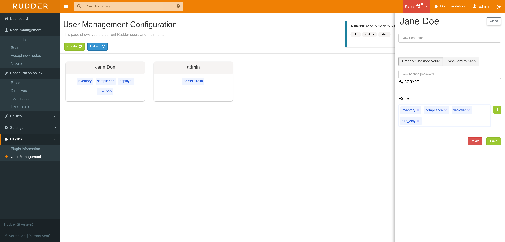
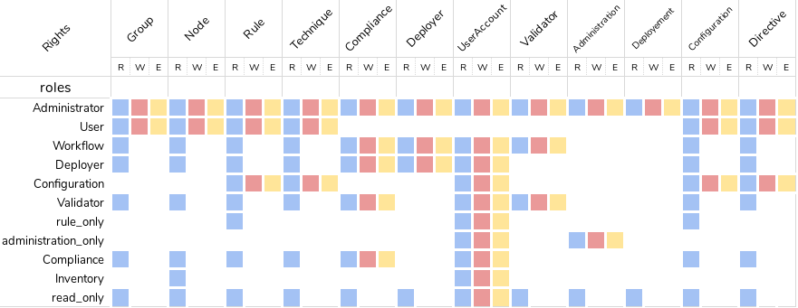

# Rudder plugin: User Management

This project is part of Rudder - IT infrastructure Automation and Compliance.
See: http://rudder.io for more information.

See repository main README for information about licensing, contribution, and
other general information.

// Everything after this line goes into Rudder documentation
// ====doc====
[user-management-plugin]
= User management

This plugin allows to manage rudder users by adding new users, update existing user's information such as the username, password and add extended authorizations for them.
Users also gain the possibility to have a personal API token with the same rights that
they have themself.

In the xml file, the role attribute is a list of permissions/roles, separated by
a comma. Each one adds permissions to the user. If one is wrong, or not correctly
spelled, the user is set to the lowest rights (NoRights), having access only to the
dashboard and nothing else.

== Pre-defined roles

|====
|Name                | Access level
|administrator | All authorizations granted, can access and modify everything
|administration_only | Only access to administration part of rudder, can do everything within it.
|user | Can access and modify everything but the administration part
|configuration | Can only access and act on configuration section
|read_only | Can access to every read only part, can perform no action
|inventory | Access to information about nodes, can see their inventory, but can't act on them
|rule_only | Access to information about rules, but can't modify them
|workflow  | Access to all workflow usage like validate and deploy changes
|compliance| Can access and act on compliance section
|deployer  | Access to workflow usage and compliance
|validator | Can access and act on compliance and validator part
|====

For each user you can define more than one role, each role adding its authorization to the user.

Example: "rule_only,administration_only" will only give access to the "Administration" tab as well as the
Rules.

.Nesting of roles 
image::docs/images/authorization_nesting.png[]

== Custom roles

You can set a custom set of permissions instead of a pre-defined role.

A permission is composed of a type and a level:

* Type:  Indicates what kind of data will be displayed and/or can be set/updated by the user
** *configuration*, *rule*, *directive*, *technique*, *node*, *group*, *administration*, *deployment*.
* Level: Access level to be granted on the related type
** *read* to read given items
** *write* can create/delete items
** *edit* can modify existing items
** *all*

Depending on that value(s) you give, the user will have access to different pages and action in Rudder.

Usage example:

* *configuration_read* -> Will give read access to the configuration (Rule management, Directives and Parameters)
* *rule_write, node_read* -> Will give read and write access to the Rules and read access to the Nodes

.Authorization's rights

== Password Hash

The credentials of a user are defined in the XML file
`/opt/rudder/etc/rudder-users.xml`. This file expects the following format:

----

<authentication hash="bcrypt">
  <user name="Jane Doe"  password="xxxxxxx" role="inventory,compliance,rule_only"/>
  <user name="admin"    password="xxxxxxx" role="administrator"/>
  <user name="John Doe" password="xxxxxxx" role="no_rights"/>
</authentication>

----

The plugin uses the hash function set in this file to hash and store your password (which is https://en.wikipedia.org/wiki/Bcrypt[BCrypt] by default). +

.BCrypt parameters
[NOTICE]
===========

By default RUDDER uses bcrypt with **2b** as version and the *cost set to 12*. If you want to change the cost you need set it in the `rudder.bcrypt.cost` property in `/opt/rudder/etc/rudder-web.properties` +

===========
