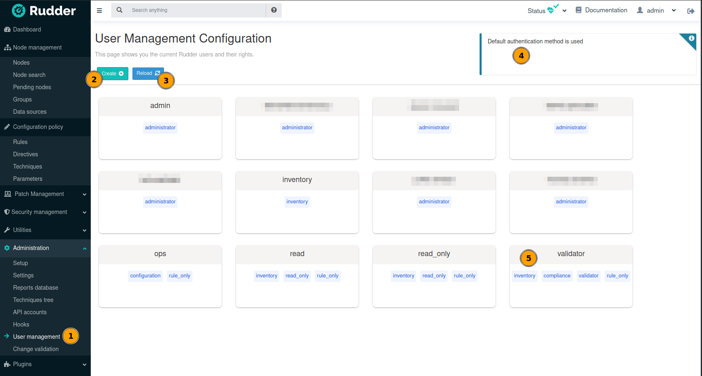
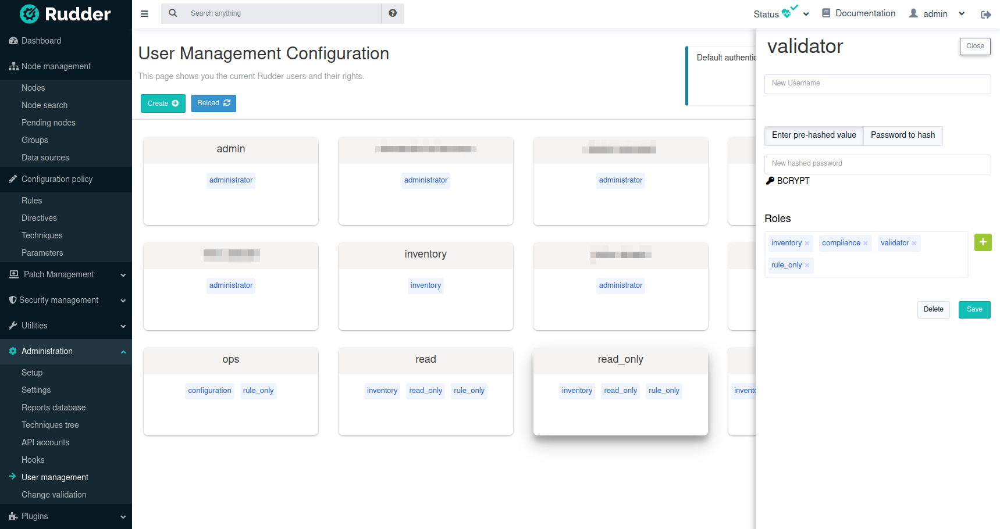
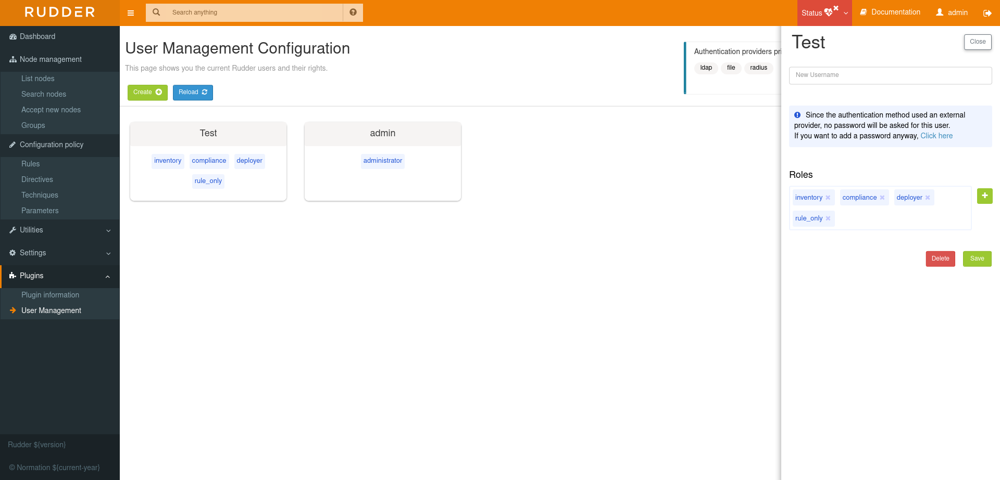
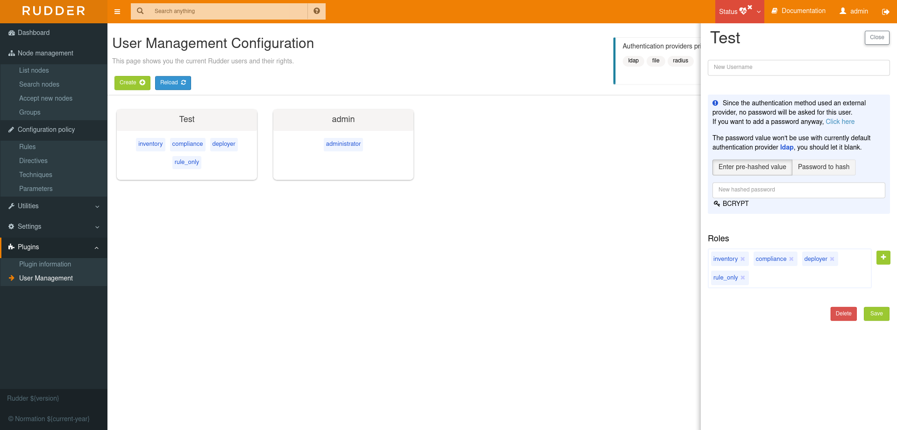

# Rudder plugin: User Management

This project is part of Rudder - IT infrastructure Automation and Compliance.
See: http://rudder.io for more information.

See repository main README for information about licensing, contribution, and
other general information.

// Everything after this line goes into Rudder documentation
// ====doc====
[user-management-plugin]
= User management

This plugin allows to get new capabilities for user management:
- you can assign fined-grained permissions to user through roles,
- and a UI is added in Rudder `Administration` menu to help with user management.

Note that the xref:plugins:api-authorizations.adoc[API authorizations] plugin also extends user
rights with a self-service UI to manage an API token to perform API calls with their personal account. 
See the xref:plugins:api-authorizations.adoc[plugin documentation] if you need more info about that feature.


== Unitary permission: a right

Rudder is using a system of fined-grained permissions to gain access to some part of the UI and to be able to
execute actions through it or APIs.

An unitary permission is named a `right`. It is composed of an object type and an operation applied to that object:

* Object:  Indicates what kind of data will be displayed and/or can be set/updated by the user
* Operation: Access level to be granted on the related object

=== Object type

Object types are linked to Rudder functional domains, like "things related to node management and inventories"
(identified by the object name `node`) or "configure and view rules" (identified by the object name `rule`).
Rudder plugins can bring new object types, documented in the plugin, like `cve` (for the CVE plugin).

The list of core object type is:

* *administration*: for rights on operations related to Rudder settings, plugin management, user management, etc.
* *compliance*: for rights related to access to compliance information (especially with APIs).
* *configuration*: for rights about configuration objects. It is a super-set of `rule`, `group`, `directive`, `technique`, `parameter`.
* *deployer* and *validator*: for rights linked to change validation.
* *deployment*: for rights linked to manual policy generation.
* *directive*: for access, creation, deletion and configuration of directives.
* *group*: for access, creation, deletion and configuration of groups.
* *node*: rights to accept or refuse nodes, access inventory, change properties or settings.
* *parameter*: for access, creation, deletion and configuration of parameters.
* *rule*: for access, creation, deletion and configuration of rules.
* *technique*: for access, creation, deletion and configuration of techniques.
* *userAccount*: rights related to user information access or personal API token management.

In addition to these domain-bound rights, Rudder internally manages two special rights:

* `no rights` is a special permission that forbids access to everything. It is given when something not expected happens (like permission computation errors, or `user-management` plugin disabled) so that users don't get more rights than they should be allowed to.
* `any rights` is a special permission given to the `administrator` special role defined below that gives access to everything, whatever the rights to manage it are.

=== Operations

Rudder defines standard access level linked to objects that reflects the operation allowed for that
object type:

* *read* to read given items
* *write* can create/delete items
* *edit* can modify existing items
* *all* which is a shortcut for "read, write, edit".

=== Right syntax

A right is defined by the syntax `${type}_${level}`:

* *configuration_read* will give read access to the configuration (rule management, directives, etc)
* *node_all* will give access to all action related to nodes.

=== Correspondence with API permissions

In Rudder, each permission grants access to some REST API endpoint mapping the corresponding action.

== Permissions

In Rudder, `permissions` are a list of `rights` or `roles`.

== Roles

Permissions can be assigned a name to become a `role` to ease the management of user permissions.
Rudder comes with some predefined roles and you can create your own custom role to fit your needs or take
into account rights provided by plugins.

=== Pre-defined roles

==== Administrator

Rudder has a special `administrator` role. That role, the only one enabled without the `user-management` plugin, grants
access and modification rights to everything, including Rudder settings, plugin management, etc. Use it with care.

==== Other pre-defined roles

Rudder `user-management` plugin comes with a set of pre-defined roles corresponding to the common use cases
for interacting with Rudder.
They are provided for convenience, but if they don't fit your need you can define your own roles (see following paragraph).

|====
|Name                | Access level
|administration_only | Only access to administration part of rudder, can do everything within it.
|user | Can access and modify everything but the administration part
|configuration | Can only access and act on configuration section
|read_only | Can access to every read only part, can perform no action
|inventory | Access to information about nodes, can see their inventory, but can't act on them
|rule_only | Access to information about rules, but can't modify them
|workflow  | Access to all workflow usage like validate and deploy changes
|compliance| Can access and act on compliance section
|deployer  | Access to workflow usage and compliance
|validator | Can access and act on compliance and validator part
|====

The precise permission set for each role is presented below:

.Permission for pre-defined roles
image::docs/images/details_rights.png[]

=== Custom roles

You can define custom roles as union set of any permissions, ie any rights or other roles.
Custom roles are defined in the files `/opt/rudder/etc/rudder-users.xml` with the following syntax:

```
<authentications>
  <custom-roles>
      <role name="read-only-restricted" permissions="node_read,rule_read" />
      <role name="read-only-extended"   permissions="read-only-restricted,configuration_read" />
      <role name="cve-access"           permissions="cve_read" />
      <role name="auditor"              permissions="cve-access, compliance" />
  </custom-roles>
  ...
</authentications>
```

We can see that:

* a custom role has two parameters:
** `name`: the name used to identify the role. It must be unique and can't use right syntax
`xxxx_[read,write,edit,all]`, and it can't reuse an existing name from a pre-defined role.
** `permissions`, which are a comma separated list of rights or role names. More precisely, the list can be
a list of rights (`read-only-restricted`,`cve-access`), or a mix of rights and roles
(`read-only-extended`), or even a list of other pre-defined or custom roles (`auditor`).
Role order definition does not matter.

The permissions granted by the role is the union of all rights granted by each right
or role in the permission list.
If a name in the `roles` list is unknown, it is ignored and grant no additional rights.


== User credentials

User credentials are defined in the same file as custom roles, `/opt/rudder/etc/rudder-users.xml` with the following syntax:

```
<authentications>
  <custom-roles>
      <role name="read-only-restricted" permissions="node_read,rule_read" />
      <role name="read-only-extended"   permissions="read-only-restricted,configuration_read" />
      <role name="cve-access"           permissions="cve_read" />
      <role name="auditor"              permissions="cve-access, compliance" />
  </custom-roles>

  <user name="user_1" password="..."  permissions="node_read,node_write,configuration" />
  <user name="user_2" password="..."  permissions="auditor" />
  ...
</authentications>
```

`user` tag can have the following parameters:
- `name` and `password` parameters are explained in xref:reference:administration:users.adoc[user administration page].
- `permissions` has the same semantic as `permissions` in custom roles;


== User management plugin interface

This plugin also provides an interface to ease user management. For now, only user can be updated with it, not roles.

The UI is available in the `Administration` menu on `User management` entry (1):



With that UI, you can add a new user (2), reload `/opt/rudder/etc/rudder-users.xml` file from disk (3) and see
what is the current authentication method configured for users (see the xref:plugins:auth-backends.adoc[authentication
backends plugin] for more information on that subject).
You also have access to the list of configured users and their permissions (5). When you click on a user, you get
the user details and you can update them:




WARNING: The plugin is not subject to validation workflow when `change validation` plugin is enabled: no change request will be generated when modifications are made.


=== Authentication backend fallback

When you use an external provider for authentication, password will not be asked. However, you can still add a password,
but it will only be used for the authentication as a fallback.




Please consult the dedicated documentation about the plugin xref:plugins:auth-backends.adoc[authentication backends]
if you need more details.
