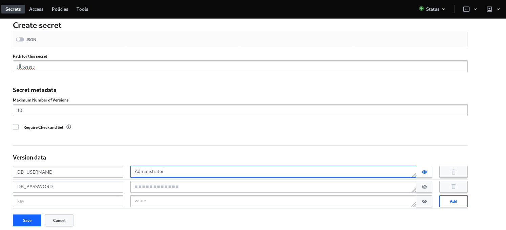
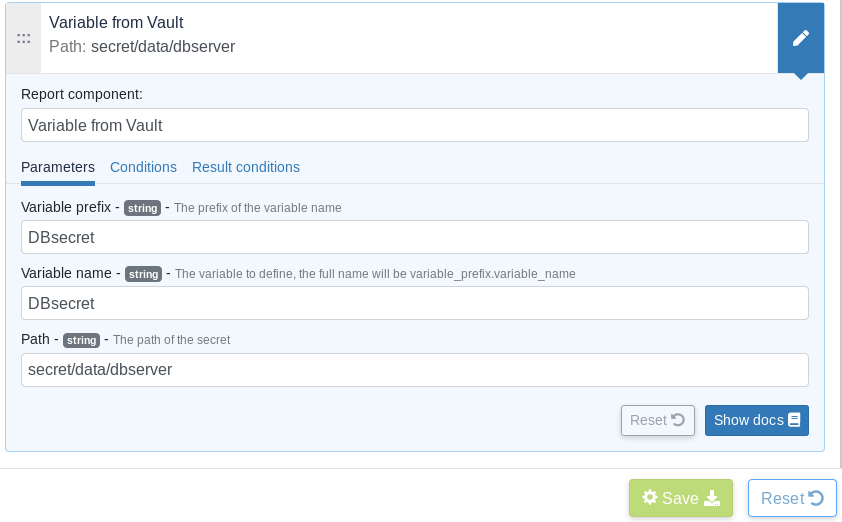

# Plugin for Vault and Rudder

This project is part of Rudder - IT infrastructure Automation and Compliance. See: http://rudder.io for more information.

See repository main README for information about licensing, contribution, and other general information.

// Everything after this line goes into Rudder documentation
// ====doc====
[vault-plugin]
= Vault

Vault is a centralized custom solution by Hashicrop, to manage secret that provides: 

* A database to securely storing secrets.
* A unified interface to any secret.	
* Tight access control based on policies.
* A detailed audit log.
* Knowing who is accessing what secret.
* Several authentication methods to access it.

This plugin provides a possibility to fetch secrets from a Vault server and use them as Rudder variables directly on the agent. 
For security purpose, the Rudder server itself does not need to have access to the Vault.

== Installation

* You're supposed to already have your Vault server installed and configured, also configured with secrets that can be any of the following types: SSL certificates and keys for your organization's domain, credentials to connect to a corporate database server.

* Install the plugin on your Rudder server 

* Edit the configuration file in `/var/rudder/plugin-resources/vault.json` on each agent.
This config file must contain the address of your Vault server, credentials to access it based on the auth mode you want to use. 
Auth modes can be: token, userpass or tls.

To note that if you have a valid certificate in your Vault server, you need to specifiy 'true' as a value in the verify_certificate key 
which is the case by default however if you have a self signed one, you need to simply switch the value to 'false'.
  
A sample config is in `share/plugins/vault/sample_vault.json`.

== Usage

Use the *Variable from Vault* generic method in Rudder to fetch secrets. 
Make sure the agent have a proper `vault.json` configuration as mentioned above. 

=== Example of usage :
* Secret definition via Vault Web Interface:

Start by creating the secret for the database server login information by 
clicking on the already defined secret engine for the key and value storage which is /secret:  

image::docs/images/CreateSecret1.jpg[]

Then click on creating secret: 

image::docs/images/CreateSecret2.jpg[]

Now you have to set the parameters for your secret, which are basically the path (in other words the name of the secret), 
the number of versions and most importantly the key values parameters: 

* Secret fetching via Rudder Server technique editor:
 
Finally you need to define the generic method on the Rudder technique editor, the most important parameter is the path to the secret which needs to include `/data`
so it can retrieve the key and value that are defined under the secret name.

