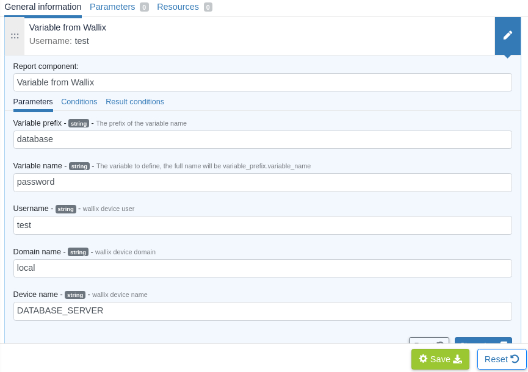

# Plugin for Wallix Bastion and Rudder

This project is part of Rudder - IT infrastructure Automation and Compliance. See: http://rudder.io for more information.

See repository main README for information about licensing, contribution, and other general information.

// Everything after this line goes into Rudder documentation
// ====doc====
[Wallix Bastion-plugin]

= Bastion Wallix integration plugin with Rudder

= Plugin Description
This is a first version of Wallix Bastion plugin integration with Rudder that allows, via a generic method, a Wallix Bastion user to authenticate and provide his credentials in order to get either a password or an ssh key of a target user associated with a target device configured in Bastion server.

== Introduction to Wallix Bastion
Wallix is a solution destined for system administrators that would like to manage their infrastructure in terms of secrets storage, management, traceability, control access, etc.

Wallix Bastion uses `waapm` (Wallix Application to Application Password Management) to use the Bastion APIs and fetch a secret,making it available to an application.

Basically an AAPM is a feature that elminates the need to store credentials or any kind of secret in configuration file or whatever and instead, to fetch those secrets, a privileged user can do so by using REST API in a secure and reliable manner.

The main key features of Wallix Bastion are:

* Stores and manages secrets.
* Offers secure access to credentials.
* Acts as filter proxy.
* Manages accounts and records session.
* Stores and manages the secrets.
* Controls and monitors remote access.
* Integrates access control (ACL) and traceability functionalities.

The one particular thing about Wallix Bastion is that it provides an authentication process for Bastion users via a 'seal' process
and then password borrows via a 'checkout', all this for a limited time per target user but this delay can be incresead.

== Prerequisites
This plugin requires that you have WAAPM already installed on the agents as well as for the Wallix Bastion server that must be configured with your Bastion users, Bastion target users and devices.
 
== Installation

* Install the plugin on your Rudder server.

* Edit the configuration file in `/var/rudder/plugin-resources/wallix.json` on each agent.
This config file must contain the address of your Wallix Bastion server, your privileged Bastion username and password.

A sample config can be found on the Rudder server in `/opt/rudder/share/plugins/wallix/sample_wallix.json`.

== Usage

Use the *Variable from Wallix* generic method in Rudder to fetch target user password.
Make sure the agent have a proper `wallix.json` configuration as mentioned above.

=== Example of usage :
To follow this use case, you have to configure your Wallix Bastion server with :

* A Bastion user with a profile that has the appropriate privileges.
* A target user defined in a targed device.
* A User group for your Bastion user and target machines group.
* An authorization that links user group and target group.

Regarding the plugin use, after its installation and configuring the appropriate parameters in the `wallix.json` file, you must be able to go to the technique editor and search for 'Variable from Wallix' generic method after technique creation.

In the method parameters below, you are required to provide the target username, domain and target device, by default domain value is configured as 'local' as it is in the Bastion Wallix server.

The secret will be stored in the `variable_prefix.variable_name` variable as you can use it elsewhere on the agents.

